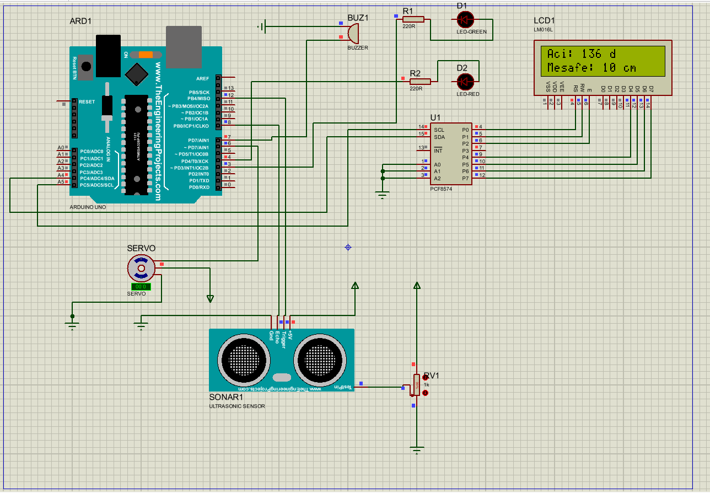

#  Arduino Tabanlı Mini Radar Tarama Sistemi

Bu proje, bir ultrasonik sensör ve servo motor kullanarak çevredeki nesneleri tespit eden ve bunları simüle eden bir radar sistemidir.

##  Proje Görünümü (Proteus Devresi)

*(Devrenin çalışır haldeki simülasyon görüntüsü)*

##  Kullanılan Donanımlar ve Teknolojiler
* **Mikrodenetleyici:** Arduino UNO R3 
* **Sensör:** HC-SR04 Ultrasonik Mesafe Sensörü,Aktif Buzzer
* **Motor:** SG90 Servo Motor,Yeşil ve Kırmızı Led 
* **Simülasyon:** Proteus Design Suite
* **Yazılım:** Arduino IDE (C++)

##  Nasıl Çalışır?
1. Servo motor 0 ile 180 derece arasında tarama yapar.
2. Her 2 derecede ultrasonik sensör mesafeyi ölçer.
3. Elde edilen veriler LCD ekrana yansıtılır.
4. Nesne kritik mesafe aralığına girdiğinde, sistem ses ile uyarı verir ve kırmızı ledi yakar, Nesne kritik mesafe aralığı dışında ise sürekli yeşil led yanar.

##  Dosya Yapısı
* `/Arduino_Kodu`: Sistemin .ino uzantılı kaynak kodları.
* `/Proteus_Devresi`: Devrenin şematik ve simülasyon dosyaları.

Geliştirici: [MEHMET AYDIN ERBEY]  